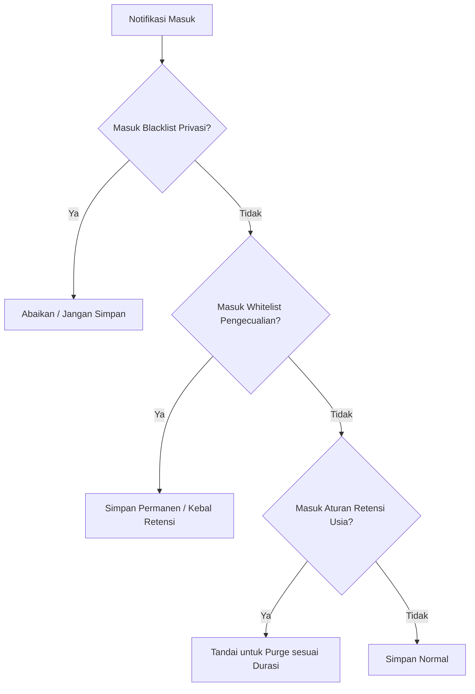

# 01. Business Logic Fixes & Domain Rules

> **Navigation**: [← Docs Index](README.md) | **01. Business Logic** | [02. App Logic →](02_APP_LOGIC_FIXES.md)

Dokumen ini mendefinisikan aturan bisnis (*domain business logic*) untuk aplikasi Notification Manager (`manage_notif_app`). Aturan bisnis menentukan *apa* nilai aplikasi, *bagaimana* notifikasi diperlakukan secara logis, dan hierarki keputusan sebelum masuk ke implementasi teknis.

---

## 1. Definisi Kebijakan Pemfilteran: Blacklist vs Auto-Purge vs Audit

### Masalah Saat Ini:
Implementasi saat ini memiliki kontradiksi:
- Ingin *"Saved First"* untuk audit log.
- Namun jika notifikasi masuk daftar `blockedApps` atau `blockedKeywords`, sistem menyimpannya ke database lalu **langsung menghapusnya** (`db.delete()`).
- Hal ini menghabiskan write cycles I/O tanpa memberi manfaat audit trail (karena data langsung hilang).

### Aturan Bisnis yang Diperbaiki (The 3-Tier Policy):
1. **Tier 1 — Privacy Ignore / Pure Blacklist**:
   - **Tujuan**: Keamanan, privasi pengguna, dan efisiensi penyimpanan.
   - **Aturan**: Jika aplikasi atau keyword ada di daftar ini (misal: aplikasi perbankan sensitif, password manager), notifikasi **sama sekali tidak disimpan ke SQLite** dan tidak dicatat.
2. **Tier 2 — Audit & Auto-Archive (Saved First)**:
   - **Tujuan**: Mengetahui adanya notifikasi tanpa mengotori daftar utama.
   - **Aturan**: Notifikasi disimpan dengan flag `is_auto_removed = 1` atau status `archived`. Tetap ada di audit trail jika pengguna sewaktu-waktu membutuhkan investigasi riwayat.
3. **Tier 3 — Retention & Auto-Purge (Pembersihan Berkala)**:
   - **Tujuan**: Mencegah database membengkak seiring waktu.
   - **Aturan**: Notifikasi berumur lebih dari ambang batas (1 jam, 24 jam, 7 hari, 30 hari) akan dihapus secara otomatis, **kecuali** dilindungi oleh Whitelist.

---

## 2. Hierarki Resolusi Aturan (Rule Priority Resolution)

Jika satu notifikasi memenuhi beberapa kriteria sekaligus, resolusi harus mengikuti urutan prioritas bisnis berikut:

**Urutan Prioritas Mutlak**:
$$\text{Privacy Ignore (Blacklist)} > \text{Whitelist Pengecualian} > \text{Auto-Purge Retensi} > \text{Default Log}$$

---

## 3. Klasifikasi & Kategori Notifikasi (Notification Classification)

### Masalah Saat Ini:
Semua notifikasi diperlakukan datar (flat). Promosi diskon, OTP perbankan, dan pesan chat keluarga bercampur dalam satu timeline tanpa pembobotan.

### Aturan Bisnis yang Ditambahkan:
Sistem harus mengkategorikan notifikasi secara otomatis berdasarkan signature paket atau kata kunci:
- **Kategori `Transactional / Security`** (e.g., OTP, Bank, Login Alert, Two-Factor):
  - *Aturan Bisnis*: Secara default masuk daftar proteksi (tidak mudah terhapus), atau diberi kebijakan *auto-shred* setelah 15 menit jika pengguna mengaktifkan mode privasi tinggi.
- **Kategori `Communication`** (e.g., WhatsApp, Telegram, Gmail):
  - *Aturan Bisnis*: Prioritas tinggi, tampilkan nama pengirim dan rangkuman percakapan.
- **Kategori `Promotional / Marketing`** (e.g., promo e-commerce, diskon makanan):
  - *Aturan Bisnis*: Retensi pendek (misal 24 jam) agar tidak memenuhi memori.
- **Kategori `Ongoing / System`** (e.g., download progress, media player, status koneksi):
  - *Aturan Bisnis*: Default **diabaikan** dari penyimpanan riwayat permanen karena tidak bernilai historis.

---

## 4. Definisi Unit Notifikasi (Deduplikasi & Threading)

### Masalah Saat Ini:
Satu percakapan WhatsApp yang aktif mengirim 10 notifikasi dalam 2 menit dicatat sebagai 10 baris terpisah, menyebabkan spam log.

### Aturan Bisnis:
- **Identitas Unik Objek**: Sebuah notifikasi dianggap sebagai *update dari entitas yang sama* jika:
  - `package_name` identik,
  - `title` / contact name identik,
  - Diterima dalam interval toleransi waktu (&le; 10 detik).
- **Aturan Pembaruan**: Sistem memperbarui pesan terakhir dan timestamp entri yang sudah ada daripada membuat 10 baris duplikat.

---

## 5. Kebijakan Privasi & Kepatuhan Ekspor Data (Data Privacy & Export Compliance)

### Aturan Bisnis:
- **Hak Hapus Data (Right to be Forgotten)**: Pengguna memiliki hak menghapus riwayat per aplikasi, per rentang tanggal, atau seluruh database dengan satu tindakan jelas.
- **Masking Data Sensitif pada Ekspor Excel**:
  - Saat mengekspor ke `.xlsx`, berikan opsi kepada pengguna untuk melakukan masking otomatis pada pola 4-6 digit angka (kode OTP) dan nomor kartu kredit demi melindungi data pribadi jika file dibagikan via WhatsApp/Email.

---

## 6. Matriks Status Implementasi

| Aturan Bisnis | Status Saat Ini | Lokasi Kode / Modul | Target Target Rilis |
| :--- | :--- | :--- | :--- |
| **Saved First Policy** | Selesai (v2) | `lib/services/database_helper.dart` | v1.1.0 (Aktif) |
| **Retention in Hours (1h, 24h, dll)** | Selesai (v2) | `purgeRetentionOlderThan()` | v1.1.0 (Aktif) |
| **Exclude Whitelist (Apps & Keywords)** | Selesai (v2) | `lib/models/auto_remove_settings.dart` | v1.1.0 (Aktif) |
| **3-Tier Policy (Privacy Blacklist)** | Sebagian (Masih Purge Langsung) | `MyNotificationListener.kt` | v1.2.0 |
| **Deduplikasi Threading Chat** | Direncanakan | `DatabaseHelper.dart` | v1.3.0 |
| **Sensitive Data Masking (Excel)** | Direncanakan | `NotificationProvider.exportToExcel()` | v1.2.0 |

---

> **Lanjut Membaca**: [02. Application Logic Fixes & Architecture →](02_APP_LOGIC_FIXES.md)
